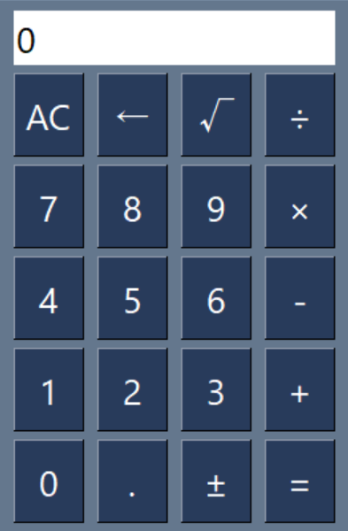

# Calculator
## Overview
A simple desktop calculator application built with Python and PySimpleGUI.

## Screenshot
<p align="center">
  
</p>

## Features
- Performs basic arithmetic operations (+, −, ×, ÷)
- Supports square root (√) calculations
- Supports sign toggle (±) for a single numeric value
- Supports decimal number calculations
- Clear (AC) and Backspace (←) functions

## Technologies
- Python
- PySimpleGUI

## How to Run
1. Install the required package.

```bash
pip install PySimpleGUI
```

2. Run the application.

```bash
python calculator.py
```

## What I learned
This project helped me understand:
- How to create a simple GUI with PySimpleGUI
- How to handle button click events
- How to calculate a string expression using `eval()`
- How to convert values between strings and numbers using `str()` and `float()`
- How to improve an existing tutorial project by adding small features

## Future Improvements
- Improve the percentage (%) function
- Add support for keyboard input

---

# 🇯🇵 日本語
## 概要
Python・PySimpleGUIを使用し、四則演算や平方根計算ができるデスクトップ電卓アプリを作成しました。
教材をベースに、演算子表示や機能を改善し、一般的な電卓に近いUIへ変更しました。

## 機能
- 四則演算（＋・−・×・÷）
- 平方根（√）の計算
- 単独の数値に対する符号反転（±）
- 小数点を含む計算
- AC（全消去）・Backspace（←）機能

## 使用技術
- Python
- PySimpleGUI

## 学習したこと
- PySimpleGUIを使って画面を作る方法
- ボタンが押されたときの処理の書き方
- `eval()` を使って文字列の数式を計算する方法
- `str()` や `float()` を使って、文字列と数値を変換する方法
- 教材のコードをもとに、表示や機能を少し改善する方法

## 今後の改善点
- パーセント（%）機能を一般的な電卓に近い仕様へ改善
- キーボード入力に対応
